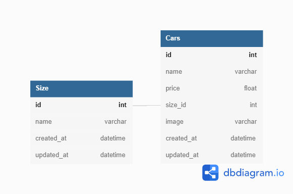

# Car Rental Management Dashboard

Car Rental Management Dashboard (REST API)

## Features

- Create new car data
- Read list of cars
- Update car data
- Delete car data
- Read filtered car data (by size)

## How to Run (Installation)

- yarn

1. Initialization

```sh
yarn sequelize-cli init
```

2. Change the config.json

```sh
change username,password,database,host,dialect in development at config.json
```

3. Create Database

```sh
yarn sequelize-cli db:create
```

4. Create table Sizes

```sh
yarn sequelize-cli model:generate --name Sizes --attributes name:string --underscored
```

5. Create table Cars

```sh
yarn sequelize-cli model:generate --name Cars --attributes name:string,price:integer,size_id:integer,photo:string --underscored
```

6. Edit table name

```sh
set table name into lowercase
```

7. Migrate

```sh
yarn migrate
```

## Tree (Directory Structure)

```
challenge
├─ .gitignore
├─ config
│  └─ config.json
├─ controller
│  ├─ car-by-id.js
│  ├─ car-delete.js
│  ├─ car-get.js
│  ├─ car-post.js
│  ├─ car-put.js
│  ├─ car_get_all.js
│  ├─ form.js
│  └─ index.js
├─ index.js
├─ migrations
│  ├─ 20220422124611-create-sizes.js
│  └─ 20220422124710-create-cars.js
├─ models
│  ├─ cars.js
│  ├─ index.js
│  └─ sizes.js
├─ package.json
├─ public
│  ├─ img
│  │  ├─ erd.png
│  │  └─ imgcar1.png
│  └─ js
│     └─ cars.js
├─ README.md
├─ seeders
└─ views
   ├─ form.ejs
   ├─ listcar.ejs
   └─ template
      ├─ footer.ejs
      └─ header.ejs

```

## Endpoints

- app.get("/", controllers.carGet) = Get home page
- app.get("/form", controllers.form) = Get page of add car
- app.get("/form/:id", controllers.form) = Get page of update car
- app.get("/api/v1/cars", controllers.carGetAll) = Get list of cars
- app.post("/api/v1/cars", controllers.carPost) = Post new car
- app.post("/api/v1/cars-upload",form.single("attachment"),controllers.carUpload) = Upload a file
- app.put("/api/v1/cars/:id", controllers.carPut) = Update car
- app.delete("/api/v1/cars/:id", controllers.carDelete) = Delete car

## Tech

| Package       | Version | Source                                    |
| ------------- | ------- | ----------------------------------------- |
| ejs           | ^3.1.7  | https://ejs.co/                           |
| express       | ^3.1.7  | https://expressjs.com/                    |
| multer        | 1.4.4   | https://yarnpkg.com/package/multer        |
| pg            | ^8.7.3  | https://yarnpkg.com/package/pg            |
| pg-hstore     | ^2.3.4  | https://yarnpkg.com/package/pg-hstore     |
| sequelize     | ^6.19.0 | https://sequelize.org/                    |
| sequelize-cli | ^6.4.1  | https://yarnpkg.com/package/sequelize-cli |

## Entity Relationship Diagram


